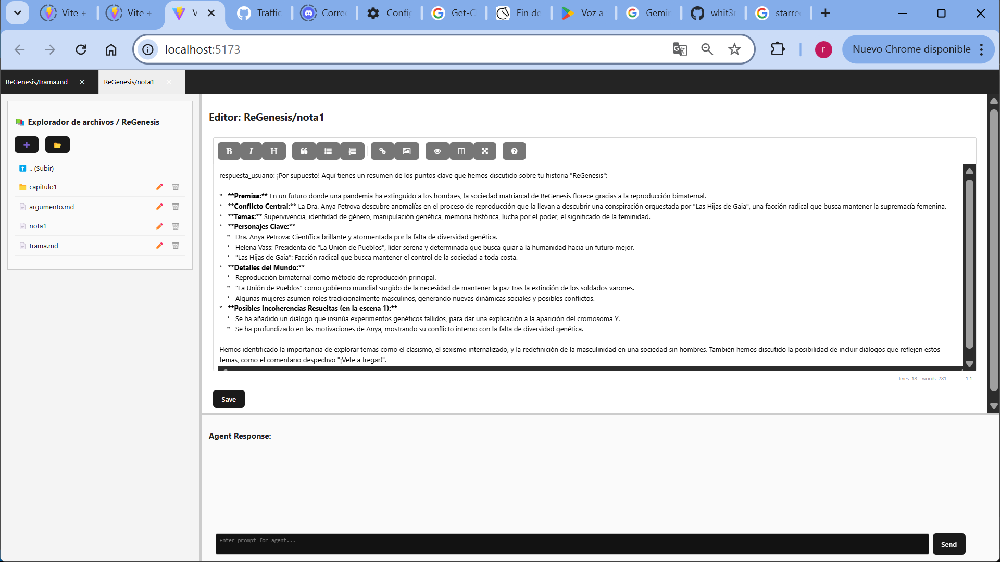
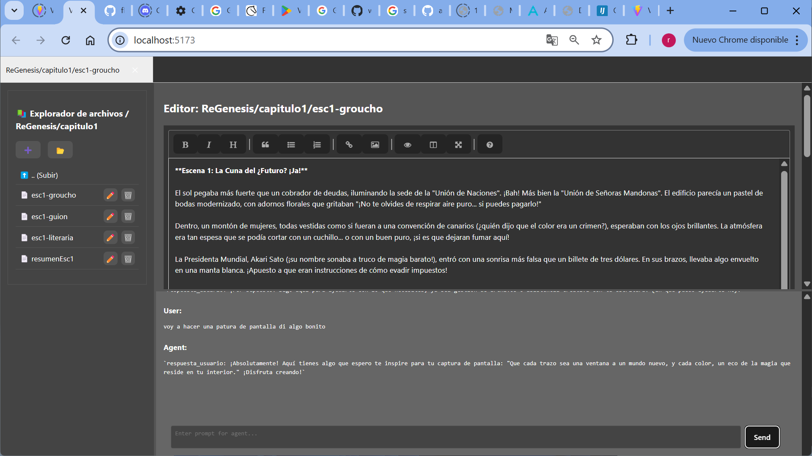

# Agente Literario

Este es un proyecto de Agente Literario.

## Capturas de Pantalla

## Instalación
### Frontend

Para instalar y ejecutar el frontend de este proyecto, siga estos pasos:

1.  Navegue al directorio del frontend: `cd agente_literario_ui/frontend`
2.  Instale las dependencias: `npm install`

### Backend

Para instalar y ejecutar el backend de este proyecto, siga estos pasos:

1.  Navegue al directorio del backend: `cd agente_literario_ui/backend`
2.  Cree un entorno virtual: `python3 -m venv venv`
3.  Active el entorno virtual: `source venv/bin/activate` (Linux/macOS) o `venv\Scripts\activate` (Windows)
4.  Instale las dependencias: `pip install -r requirements.txt`
5.  Ejecute la aplicación: `python run.py` en el directorio de raiz arrancara el back y el front

¡Disfrute de su Agente Literario!

## Advertencia

Este proyecto está diseñado para utilizar la API de Gemini. Para su correcto funcionamiento, necesitará proporcionar una API key de Gemini en el archivo .env.
Alternativamente, puede adaptar el proyecto para que funcione con Ollama u otro modelo de lenguaje de su elección.

**Precauciones de seguridad:**

*   **No exponga su API key de Gemini a terceros.**

## Descripción del Proyecto

Agente Literario es un amiguete siempre dispuesto a ayudar, diseñado para facilitar la creación y gestión de contenido literario, permitiendo a los usuarios generar historias, personajes y escenarios de manera eficiente.

Agente Literario es un agente conversacional autónomo diseñado para ayudarte a crear historias fascinantes. Utiliza el poder del lenguaje natural y la inteligencia artificial para interactuar contigo, comprender tus ideas y convertirlas en narrativas cautivadoras.

**Características Principales:**

*   Manejo de archivos con lenguaje natural: Facilita la creación y gestión de contenido literario.
*   Generación de historias interactivas: Agente Literario te guía a través del proceso de creación de historias, ofreciéndote sugerencias, ideas y opciones para desarrollar tu trama.
*   Adaptabilidad a diferentes géneros: Ya sea que te interese la ciencia ficción, la fantasía, el romance o el misterio, Agente Literario se adapta a tus preferencias y te ayuda a crear historias en el género que desees.
*   Herramientas de edición y revisión: Agente Literario te proporciona herramientas para editar y revisar tu historia, asegurando que tu narrativa sea coherente, atractiva y bien escrita.
*   Integración con herramientas externas:** Agente Literario se puede integrar con herramientas externas, como bases de datos de personajes, generadores de nombres y correctores gramaticales, para enriquecer tu proceso de creación de historias.
*   Gestión de personajes: Facilita la creación y el seguimiento de personajes a lo largo de la historia.
*   Creación de escenarios: Permite diseñar y describir escenarios detallados para ambientar las historias.
*   Sugerencia de ideas: Ofrece sugerencias para expandir y mejorar las historias.
*   Corrección de faltas: Ayuda a identificar y corregir errores gramaticales y ortográficos.
*   Reescritura: Permite reescribir secciones de la historia para mejorar la fluidez y el estilo.
*   Inspiración: Fomenta la imaginación y la creatividad en el proceso de escritura.

## Arquitectura del Agente

Agente Literario se basa en una arquitectura modular y flexible que permite adaptarlo a diferentes dominios y herramientas. El núcleo de la arquitectura es un agente conversacional autónomo que interactúa con el usuario en lenguaje natural para comprender un objetivo o tarea. Luego, de forma autónoma:

1.  **Descompone** la tarea en pasos lógicos.
2.  **Decide** la siguiente acción necesaria (que generalmente implica usar una herramienta externa o API).
3.  **Ejecuta** esa acción a través de un módulo "ejecutor".
4.  **Procesa** el resultado devuelto por la herramienta.
5.  **Itera**, usando el resultado como contexto para decidir el siguiente paso (otra acción o una respuesta final).
6.  **Finaliza** cuando la tarea está completa, comunicando el resultado final al usuario.

El prompt principal (la variable `TEMPLATE` en `main.py`) es crucial para instruir al LLM sobre su comportamiento y es la pieza clave para adaptar el agente a nuevos dominios.

## Contribución

Si desea contribuir a este proyecto, siga estos pasos:

1.  **Cree una bifurcación (fork) del repositorio:** Esto crea una copia del repositorio en su propia cuenta de GitHub.
2.  **Realice los cambios deseados en su bifurcación:** Modifique el código, añada nuevas características o corrija errores.
3.  **Envíe una solicitud de extracción (pull request):** Proponga sus cambios para que sean incorporados al repositorio principal.

## Próximos Pasos

El siguiente paso es que el agente edite directamente en el canvas para una experiencia de usuario más interactiva.
